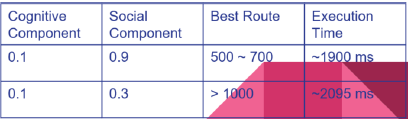
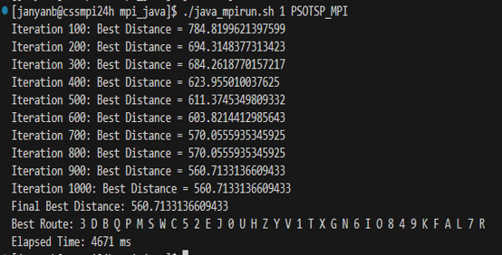
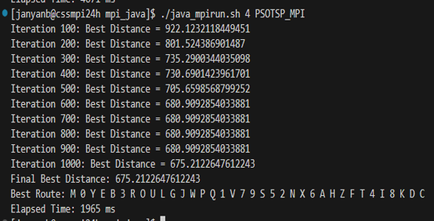

# PSO-TSP-Solver
This project implements a non-deterministic solution for the Travelling Salesman Problem (TSP) using the Particle Swarm Optimization (PSO) algorithm. The solution leverages MPI and the MASS library to parallelize computations and achieve significant performance improvements.

## Overview
The Travelling Salesman Problem is an NP-hard optimization problem where the goal is to find the shortest route that visits a set of cities exactly once and returns to the starting point. This implementation adapts PSO principles to encode routes as particles and iteratively optimize them to find the best solution.

## Key Features
- Parallization with MPI: Distributes data across 4 nodes for faster processing of 1000 randomly generated routes.
- Incorporates a swap-based technique to prevent convergence to local minima and ensure thorough exploration of the solution space.
- Synchronizes global best routes and fitness values across all nodes using MPI primitives such as MPI Bcast and MPI Allreduce.
- Social and Cognitive Component Tuning:  
  - Observed that the social component (c2) significantly influences the solution quality:
    - Higher social influence (c2): Results in better cooperation among particles, achieving optimized routes with distances between 500-700.
    - Lower social influence (c2): Limits cooperation, leading to suboptimal routes with distances greater than 1000.
      
- Achieves a 2.3x performance improvement compared to the sequential implementation.

## Execution Results
 
  *Figure: Elapsed Time with 1 node*
  
 
  *Figure: Elapsed Time with 4 nodes*
